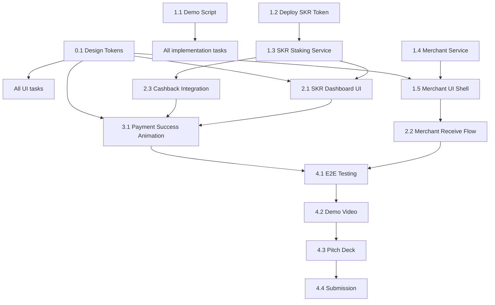

# MONOLITH Hackathon Sprint — Enhanced PhasmaPay

## Enhancement Summary

**Deepened on:** 2026-03-01
**Research agents used:** 5 (Animations, SKR Integration, Demo Strategy, Merchant Patterns, Frontend Design)

### Key Improvements from Research
1. **SKR real addresses found** — mainnet mint `SKRbvo6Gf7GondiT3BbTfuRDPqLWei4j2Qy2NPGZhW3`, staking program `SKRskrmtL83pcL4YqLWt6iPefDqwXQWHSw9S9vz94BZ`. Use 6 decimals (not 9).
2. **Solana Pay `reference` parameter** — critical missing piece for merchant payment detection. Use `getSignaturesForAddress(referencePubkey)` instead of polling token account balance.
3. **Animation stack decided** — pure Reanimated 3 for everything (confetti, ripple, counter, tier-up). No Skia dependency needed. `react-native-animated-rolling-numbers` for amount counter.
4. **BlurView gotcha** — `@react-native-community/blur` requires API 31+ for `RenderEffect`. Poco X3 (Android 12) is on the boundary. Use translucent fallback below API 31.
5. **Demo recording** — use `scrcpy` for dual-phone screen mirroring + OBS for side-by-side composition. Physical overhead shot only for the NFC tap moment.
6. **dApp Store APK gotcha** — must output APK not AAB. Separate signing key required. Min SDK API 33.
7. **Design system** — shift background from `#0a0a0a` to `#060608`, Ghost tier color from purple to `#00FF88`, add JetBrains Mono font for all amounts/addresses.

### New Considerations Discovered
- Treasury keypair needed for SKR cashback distribution (server-side sign, not MWA)
- WebSocket `onAccountChange` is unreliable on mobile — Helius explicitly recommends against it
- Confetti: keep particles under 80 for Poco X3 performance
- `elevation` on Android doesn't produce glow — use translucent circles for badge glow effect
- Privacy policy URL required for dApp Store (host on GitHub Pages)

---

## Overview

7-day sprint to enhance PhasmaPay for the MONOLITH Solana Mobile Hackathon. Target: Top 10 ($10K) + Best SKR Integration ($10K SKR). Scoring: Stickiness/PMF 25%, UX 25%, Innovation 25%, Demo 25%.

**Existing strengths:** NFC tap-to-pay, Ghost Mode stealth addresses, dual Seed Vault/MWA signer, Jupiter routing, Torque loyalty — all working on devnet.

**What we're adding:** SKR loyalty engine, merchant mode, UX wow-factor polish, demo video + pitch deck.

---

## Team Structure & Responsibilities

### Ammar — Project Manager
- Physical device testing (Oppo Reno 14 Pro + Poco X3)
- Demo video recording & editing (scrcpy + OBS + overhead shot)
- Pitch deck design (7 slides max)
- Final UX sign-off on every screen
- Submission on Align platform

### Agent Alpha — Lead Architect (Opus)
- Sprint coordination, PR reviews, architecture decisions
- Demo script authoring
- SKR integration architecture
- Code review all agent PRs before merge

### Agent Beta — Frontend/UX Engineer (Sonnet)
- **Screens:** Home redesign, Merchant Mode, SKR Dashboard, Payment Success
- **Animations:** NFC ripple, ghost pulse enhancement, confetti burst, tier-up celebration
- **Polish:** Glassmorphism cards, haptic feedback, loading/empty/error states
- **Design system:** Create `src/design/tokens.ts` with color/spacing/typography tokens
- **Styling:** Migrate all NativeWind `className` to inline styles
- **Files owned:** `app/*.tsx`, `src/components/*.tsx`, `src/design/*.ts`

### Agent Gamma — Blockchain/Services Engineer (Sonnet)
- **SKR:** Deploy devnet SPL token (6 decimals), treasury keypair, tier engine service
- **Merchant:** Tap-to-receive with Solana Pay `reference` parameter, polling detection
- **Hardening:** Ghost Mode edge cases, payment retry logic
- **Files owned:** `src/services/*.ts`, `src/utils/*.ts`, `scripts/*`

### Agent Delta — Integration/QA/Demo Engineer (Sonnet)
- E2E flow testing on physical devices
- Demo script validation (every step works)
- Pitch deck content drafting
- dApp Store submission prep (separate signing key, APK not AAB, privacy policy)
- **Files owned:** `docs/*`, test scripts

---

## Phase 0: Design System (Beta — Day 1, parallel with Phase 1)

### 0.1 Design Tokens

Create `src/design/tokens.ts`:

```ts
export const colors = {
  base:     '#060608',   // screen background (cooler than #0a0a0a)
  surface0: '#0d0d10',   // primary cards
  surface1: '#131318',   // secondary cards / inputs
  surface2: '#1a1a22',   // elevated / active states
  border:   'rgba(255,255,255,0.03)',
  borderLit:'rgba(255,255,255,0.08)',

  purple:   '#9945FF',
  purpleDim:'rgba(153,69,255,0.25)',
  green:    '#14F195',
  greenDim: 'rgba(20,241,149,0.12)',
  ghost:    '#00FF88',   // Ghost Mode ONLY
  ghostDim: 'rgba(0,255,136,0.08)',

  gold:     '#FFD700',
  silver:   '#B8C5D6',
  bronze:   '#D4845A',

  error:    '#FF3B5C',
  warning:  '#FF9F0A',

  text:     '#F0F0F8',   // not pure white — avoids eye strain
  textSub:  '#6B6B80',
  textMute: '#2E2E3A',
};

export const space = { xs: 4, sm: 8, md: 12, base: 16, lg: 20, xl: 24, xxl: 32, xxxl: 48 };
export const radius = { sm: 8, md: 12, lg: 16, xl: 20, xxl: 24, full: 9999 };
```

### 0.2 Typography

Load JetBrains Mono via `expo-font` in `app/_layout.tsx`:

```ts
export const type = {
  amountHero:  { fontFamily: 'JetBrainsMono-Bold',   fontSize: 48, letterSpacing: -2 },
  amountLarge: { fontFamily: 'JetBrainsMono-Bold',   fontSize: 32, letterSpacing: -1 },
  amountSmall: { fontFamily: 'JetBrainsMono-Regular', fontSize: 16 },
  address:     { fontFamily: 'JetBrainsMono-Regular', fontSize: 11, letterSpacing: 0.5 },
  label:       { fontSize: 10, letterSpacing: 2, textTransform: 'uppercase', fontWeight: '700' },
  body:        { fontSize: 15, lineHeight: 22 },
  caption:     { fontSize: 12, lineHeight: 18 },
};
```

### 0.3 Haptic Patterns

Create `src/utils/haptics.ts`:

```ts
import * as Haptics from 'expo-haptics';

export const hapticPatterns = {
  paymentSuccess: async () => {
    await Haptics.impactAsync(Haptics.ImpactFeedbackStyle.Light);
    await new Promise(r => setTimeout(r, 80));
    await Haptics.impactAsync(Haptics.ImpactFeedbackStyle.Light);
    await new Promise(r => setTimeout(r, 80));
    await Haptics.impactAsync(Haptics.ImpactFeedbackStyle.Heavy);
  },
  nfcTap: () => Haptics.impactAsync(Haptics.ImpactFeedbackStyle.Medium),
  tierUpgrade: async () => {
    await Haptics.impactAsync(Haptics.ImpactFeedbackStyle.Light);
    await new Promise(r => setTimeout(r, 60));
    await Haptics.impactAsync(Haptics.ImpactFeedbackStyle.Medium);
    await new Promise(r => setTimeout(r, 60));
    await Haptics.impactAsync(Haptics.ImpactFeedbackStyle.Heavy);
    await new Promise(r => setTimeout(r, 100));
    await Haptics.notificationAsync(Haptics.NotificationFeedbackType.Success);
  },
  error: () => Haptics.notificationAsync(Haptics.NotificationFeedbackType.Error),
  tap: () => Haptics.selectionAsync(),
};
```

**File changes:**
- `src/design/tokens.ts` — new file
- `src/utils/haptics.ts` — new file
- `app/_layout.tsx` — load JetBrains Mono font

---

## Phase 1: Foundation (Day 1-2, Mar 1-2)

### 1.1 Demo Script (Alpha — Day 1)

Write the 3-minute demo video script. Every subsequent task is prioritized by whether it appears in this script.

**Script structure (researched optimal timing):**

| Segment | Duration | Content |
|---|---|---|
| Hook | 0:00-0:20 | "What if paying someone was as easy as tapping phones?" — physical NFC tap shot |
| Problem | 0:20-0:45 | Crypto payments are seamless online, broken in person. No privacy. |
| Ghost Mode | 0:45-1:30 | Stealth address generation (decryption effect), NFC write, tap, payment arrives, sweep |
| SKR Loyalty | 1:30-2:15 | Tier dashboard, balance determines tier, payment → cashback in receipt |
| Merchant | 2:15-2:45 | Flip toggle, tap-to-receive, "Payment received!" animation, running total |
| Close | 2:45-3:00 | "PhasmaPay — tap, pay, vanish." Architecture slide, Seeker callout |

**Research insight:** Per Colosseum's guide, explicitly narrate WHY Solana — MWA is better than WalletConnect, Seeker NFC is hardware-native, sub-second finality. Judges dock points for missing this.

**Recording plan:**
- scrcpy mirrors both phones to Mac via USB
- OBS captures both scrcpy windows side-by-side ("Merchant" / "Customer" labels)
- Physical overhead shot (tripod + matte black surface) for the NFC tap moment only
- Voiceover scripted word-for-word, timed to 2:45 with 15s buffer
- No background music during voiceover sections

**Deliverable:** `docs/demo-script.md`

### 1.2 Deploy Devnet SKR Token (Gamma — Day 1)

Create a real SPL token on devnet to replace the placeholder `SKR_MINT`.

**Research insights:**
- Use **6 decimals** (not 9) — matches mainnet SKR
- Mainnet SKR mint: `SKRbvo6Gf7GondiT3BbTfuRDPqLWei4j2Qy2NPGZhW3`
- Staking program: `SKRskrmtL83pcL4YqLWt6iPefDqwXQWHSw9S9vz94BZ`

**Tasks:**
```bash
# 1. Create devnet mint (6 decimals)
solana config set --url devnet
spl-token create-token --decimals 6
# Save output address as DEVNET_SKR_MINT

# 2. Create ATA + mint 1M tokens
spl-token create-account <DEVNET_SKR_MINT>
spl-token mint <DEVNET_SKR_MINT> 1000000

# 3. Create treasury keypair + fund it
solana-keygen new -o scripts/treasury.json
spl-token create-account <DEVNET_SKR_MINT> --owner scripts/treasury.json
spl-token transfer <DEVNET_SKR_MINT> 500000 <treasury_ata>
```

**Update `src/utils/constants.ts`:**
```ts
export const SKR_MINT_MAINNET = 'SKRbvo6Gf7GondiT3BbTfuRDPqLWei4j2Qy2NPGZhW3';
export const SKR_MINT = process.env.EXPO_PUBLIC_SKR_MINT || SKR_MINT_MAINNET;
export const SKR_DECIMALS = 6;
export const SKR_STAKING_PROGRAM = 'SKRskrmtL83pcL4YqLWt6iPefDqwXQWHSw9S9vz94BZ';
```

**File changes:**
- `src/utils/constants.ts` — update `SKR_MINT`, add `SKR_DECIMALS`, `SKR_MINT_MAINNET`, `SKR_STAKING_PROGRAM`
- `scripts/mint-skr.sh` — new file
- `scripts/treasury.json` — new file (add to `.gitignore`)
- `.env.development` — add `EXPO_PUBLIC_SKR_MINT=<devnet_address>`

### 1.3 SKR Staking Simulation Service (Gamma — Day 1-2)

**Research decision:** Use balance-as-tier (Option A). Real SKR staking is via Guardians with no published IDL — can't decode per-user stake amounts in hackathon time. Frame honestly in pitch: "On mainnet, tiers read from Guardian staking program. On devnet, we read token balance."

**Tasks — `src/services/skrStaking.ts`:**

```ts
// Existing getSkrBalance in skr.ts is correct — reuse it
// Add cashback tx builder:

export async function buildSkrCashbackTx(
  connection: Connection,
  treasury: PublicKey,
  recipient: PublicKey,
  skrAmount: number,
  skrMint: PublicKey
): Promise<Transaction> {
  const treasuryAta = getAssociatedTokenAddressSync(skrMint, treasury);
  const recipientAta = getAssociatedTokenAddressSync(skrMint, recipient);
  const rawAmount = BigInt(Math.round(skrAmount * 10 ** SKR_DECIMALS));
  // ... (build tx with idempotent ATA creation + transferChecked)
}

// Treasury signs server-side — NOT via MWA:
export async function distributeCashback(
  connection: Connection,
  treasuryKeypair: Keypair,
  recipient: PublicKey,
  amount: number
): Promise<string | null> {
  const tx = await buildSkrCashbackTx(...);
  return sendAndConfirmTransaction(connection, tx, [treasuryKeypair]);
}
```

**Edge case:** Treasury runs out of SKR. Add balance check before distribution, log warning if low.

**File changes:**
- `src/services/skrStaking.ts` — new file (cashback tx builder + distribution)
- `src/services/skr.ts` — keep existing tier/balance logic, update `SKR_DECIMALS` usage
- `src/services/payment.ts` — add cashback call post-payment (fire-and-forget)
- `src/utils/constants.ts` — add `SKR_TREASURY` env var

### 1.4 Merchant Mode Service (Gamma — Day 2)

**Research insight: Add `reference` parameter to Solana Pay URL.** This is the official spec mechanism for payment detection — generates a random pubkey per payment request, poll `getSignaturesForAddress(reference)` instead of watching the token account.

**Updated `buildSolanaPayUrl` in `src/services/nfc.ts`:**

```ts
export function buildSolanaPayUrl(
  recipientAddress: string,
  usdcAmount: number,
  label: string = APP_IDENTITY.name
): { url: string; reference: string } {
  const referenceKeypair = Keypair.generate();
  const reference = referenceKeypair.publicKey.toBase58();
  const params = new URLSearchParams({
    amount: usdcAmount.toString(),
    'spl-token': USDC_MINT,
    reference,  // <-- CRITICAL ADDITION
    label,
    message: 'PhasmaPay NFC Payment',
  });
  return { url: `solana:${recipientAddress}?${params.toString()}`, reference };
}
```

**Payment detection via reference polling (1.5s interval):**

```ts
export function pollForPaymentByReference(
  connection: Connection,
  referencePubkey: PublicKey,
  onReceived: (signature: string) => void,
  onTimeout: () => void,
  pollIntervalMs = 1500,
  timeoutMs = 180_000,
): () => void {
  // Poll getSignaturesForAddress(referencePubkey) every 1.5s
  // Return cleanup function
}
```

**Research insight:** Do NOT use WebSocket `onAccountChange` — Helius explicitly warns it's "brittle and unreliable" on mobile. Polling at 1.5s is the correct approach.

**Merchant storage — paginated, separate from personal history:**

```ts
// src/services/storage.ts additions
const MERCHANT_TX_KEY = 'phasma:merchant_transactions';

export type MerchantTransaction = {
  signature: string;
  sender: string;
  amount: number;
  timestamp: number;
  reference?: string;
  confirmed: boolean;
};

export async function saveMerchantTransaction(tx: MerchantTransaction): Promise<void>;
export async function getMerchantTransactions(page?: number, pageSize?: number): Promise<{ transactions: MerchantTransaction[]; hasMore: boolean }>;
export async function getMerchantDaySummary(): Promise<{ count: number; total: number }>;
```

**ModeContext for role switching:**

```ts
// src/context/ModeContext.tsx
type AppMode = 'customer' | 'merchant';
// Toggle persisted to AsyncStorage
// Tab layout swaps center tab based on mode
// Persistent "MERCHANT MODE" banner when active
```

**File changes:**
- `src/services/merchant.ts` — new file (config, reference-based polling)
- `src/services/nfc.ts` — update `buildSolanaPayUrl` to return reference
- `src/services/storage.ts` — add merchant transaction storage
- `src/context/ModeContext.tsx` — new file (customer/merchant toggle)

### 1.5 Merchant Mode UI Shell (Beta — Day 2)

**Research insight:** Use mode banner + tab reconfiguration (Square/Venmo pattern). When merchant mode is active, show persistent purple banner at top with "MERCHANT MODE" and "Switch to Customer" button.

**Tasks:**
- `app/(tabs)/merchant.tsx` — merchant dashboard:
  - Toggle switch, business name input
  - "Tap to Receive" → NFC write with reference → pulsing wait animation
  - Incoming transaction feed (FlatList with `onEndReached` pagination)
  - Today's total (count + amount) in header card
- `app/(tabs)/_layout.tsx` — conditional tabs based on `useMode()`
- Merchant mode banner in root `app/_layout.tsx`

**File changes:**
- `app/(tabs)/merchant.tsx` — new file
- `app/(tabs)/_layout.tsx` — conditional merchant tab
- `app/_layout.tsx` — ModeProvider wrapper + merchant banner
- `src/components/Icons.tsx` — add `MerchantIcon` / `MerchantOutlineIcon`
- `src/hooks/useMerchantReceive.ts` — state machine hook
- `src/hooks/useMerchantFeed.ts` — paginated feed hook

---

## Phase 2: Core Features (Day 3, Mar 3)

### 2.1 SKR Dashboard Screen (Beta — Day 3)

Add SKR section to Home screen:

- Current tier badge with glow effect
- SKR balance (JetBrains Mono, large)
- Cashback percentage
- Animated progress bar to next tier (fill from 0 on mount, 800ms, trailing shimmer)
- Lifetime cashback earned
- "Get SKR" button

**Research insight — tier colors corrected:**
- Ghost = `#00FF88` (ghost green, NOT purple — it's the baseline "no tier")
- Bronze = `#D4845A` (warmer than standard)
- Silver = `#B8C5D6` (blue-tinted, cooler)
- Gold = `#FFD700`

**Tier badge glow:** Use absolutely positioned translucent circle behind badge (not `elevation` — Android clips glow). Animate with `withSequence(withSpring(1.3), withSpring(1.0))` on tier change.

**File changes:**
- `app/(tabs)/index.tsx` — add SKR tier card
- `src/components/SkrTierCard.tsx` — new component
- `src/components/SkrTierBadge.tsx` — new component with glow (translucent circle, not elevation)
- `src/hooks/useSkrTier.ts` — new hook
- `src/services/skr.ts` — fix Ghost tier color to `#00FF88`

### 2.2 Merchant Receive Flow (Gamma + Beta — Day 3)

Full tap-to-receive wired up:

1. Merchant taps "Receive" → NFC writes Solana Pay URL with `reference` parameter
2. Customer reads NFC → PhasmaPay pay screen pre-filled
3. Customer confirms → USDC transfers
4. Merchant polls `getSignaturesForAddress(reference)` at 1.5s → "Payment received!"
5. Transaction saved to merchant feed, FlatList updates

**Gamma:** `useMerchantReceive` hook: `idle → writing → waiting → received`
**Beta:** Pulsing NFC icon while waiting, slide-in transaction card on receive, haptic `paymentSuccess`

**File changes:**
- `src/hooks/useMerchantReceive.ts` — new file
- `app/(tabs)/merchant.tsx` — add receive flow UI

### 2.3 Cashback Integration (Gamma — Day 3)

After successful USDC payment:
1. Read user's SKR balance → determine tier
2. Calculate cashback: `paymentAmount * tier.cashbackPct / 100`
3. If cashback > 0, fire `distributeCashback()` (non-blocking, `.catch(() => {})`)
4. Pass cashback amount to receipt screen via route params

**Receipt screen additions:**
- "+0.05 SKR cashback" line with rolling number animation
- Current tier badge
- If tier would change after next N payments, show progress hint

**File changes:**
- `src/hooks/usePayment.ts` — add cashback post-payment
- `app/receipt/[signature].tsx` — add cashback display + tier badge

---

## Phase 3: UX Wow Factor (Day 4-5, Mar 4-5)

### 3.1 Payment Success Animation (Beta — Day 4)

**Research-grounded implementation:**

**Amount counter:** Use `react-native-animated-rolling-numbers` — each digit rolls independently like a slot machine. More impressive than simple interpolation.

```bash
npm install react-native-animated-rolling-numbers
```

```tsx
<AnimatedRollingNumber
  value={amount}
  spinningAnimationConfig={{ duration: 600, easing: Easing.out(Easing.back(1.2)) }}
  textStyle={{ fontSize: 48, color: '#14F195', fontWeight: '700', fontFamily: 'JetBrainsMono-Bold' }}
  toFixed={2}
  prefix="$"
/>
```

**Confetti:** Pure Reanimated (40 particles max for Poco X3 safety). No Skia dependency.

```tsx
// 40 particles, Solana brand colors, 900ms duration
// Each particle: random angle, random distance (80-200px), gravity bias
// Colors: ['#9945FF', '#14F195', '#00FF88', '#FFD700', '#FF3B5C']
```

**Haptic:** Triple light-light-heavy pattern on success.

**File changes:**
- `app/receipt/[signature].tsx` — redesign with animations
- `src/components/ConfettiBurst.tsx` — new (pure Reanimated, 40 particles)
- Install: `react-native-animated-rolling-numbers`

### 3.2 NFC Tap Ripple Effect (Beta — Day 4)

**Research-grounded implementation:**

3 concentric rings, staggered by 600ms, expanding with `withRepeat` + `withTiming(2.5, 2000ms)`. Runs entirely on UI thread — safe for Poco X3.

**Enhancement:** Color-shift on state:
- `scanning` → `#9945FF` (purple)
- `read` → `#14F195` (green) — brief flash signals "got it"
- Ghost mode → `#00FF88`

Pass `stage: 'idle' | 'scanning' | 'read' | 'processing'` instead of boolean.

**Gotcha:** Reset `scale.value` and `opacity.value` to initial when `active` flips false, otherwise stale values on remount.

**File changes:**
- `src/components/NfcRipple.tsx` — new/enhanced component with stage-based colors
- Apply to: `app/pay.tsx`, `app/ghost-pay.tsx`, `app/ghost-receive.tsx`, `app/(tabs)/merchant.tsx`

### 3.3 Glassmorphism Card Component (Beta — Day 4)

**Research insight:** BlurView requires API 31+ for `RenderEffect`. Use translucent fallback below API 31.

```tsx
// src/components/GlassCard.tsx
export function GlassCard({ children, style, glow }: GlassCardProps) {
  return (
    <View style={[{
      backgroundColor: 'rgba(255,255,255,0.04)',
      borderRadius: radius.xl,
      borderWidth: 1,
      borderColor: 'rgba(255,255,255,0.08)',
      overflow: 'hidden',
    },
    glow && {
      shadowColor: glow,
      shadowOpacity: 0.25,
      shadowRadius: 20,
      elevation: 12,
    },
    style]}>
      {/* Top highlight streak for glass physicality */}
      <View style={{
        position: 'absolute', top: 0, left: 0, right: 0, height: 1,
        backgroundColor: 'rgba(255,255,255,0.12)',
      }} />
      {children}
    </View>
  );
}
```

Apply: `glow={colors.purple}` on balance card, `glow={colors.green}` on receipt, `glow={colors.ghost}` on ghost screens.

**Gotcha:** Never put BlurView inside ScrollView/FlatList. Limit 2 visible BlurViews simultaneously. Use `renderToHardwareTextureAndroid` if adding blur.

**File changes:**
- `src/components/GlassCard.tsx` — new reusable component
- Apply across all screens replacing raw `View` cards

### 3.4 Ghost Mode Decryption Effect (Beta — Day 4)

**Research-grounded:** Pure `useState` + `setInterval` at 40ms (25 FPS). Each character starts as `'█'`, resolves to random chars, then final character. Duration: 1200ms max.

**Gotcha:** Use monospace font (`JetBrainsMono`) — otherwise text jumps as character widths change.

```tsx
<DecryptText
  text={stealthAddress}
  trigger={addressGenerated}
  duration={1000}
  style={{ fontFamily: 'JetBrainsMono-Regular', color: '#00FF88', fontSize: 14, letterSpacing: 1 }}
/>
```

**File changes:**
- `src/components/DecryptText.tsx` — new component
- `app/ghost-receive.tsx` — use for address display

### 3.5 Loading, Empty, Error States (Beta — Day 5)

**Research insight:** Empty state should lean into ghost theme. History empty = ghost icon + "No hauntings yet". Claimable empty = "No ghosts waiting".

| Screen | Empty State | Loading State | Error State |
|---|---|---|---|
| Home | "Make your first payment" CTA | Balance skeleton (pulsing) | Retry button |
| History | GhostIcon 64px + "No hauntings yet" | Transaction skeleton rows | Retry |
| Merchant | "Enable merchant mode" card | - | - |
| Claimable | "No ghosts waiting" | Skeleton cards | Retry |

**Staggered entry animation:** Every screen's cards enter with 80ms stagger, `opacity: 0→1`, `translateY: 16→0`, `Easing.out(Easing.cubic)`, 400ms.

**File changes:**
- `src/components/EmptyState.tsx` — new (icon + title + subtitle + CTA)
- `src/components/SkeletonLoader.tsx` — new (pulsing placeholder)
- Apply across all screens

### 3.6 Style Consistency Audit (Beta — Day 5)

- Migrate all `className` to inline `style`
- Replace all `#0a0a0a` with `colors.base` (`#060608`)
- Replace all ad-hoc greys (`#555`, `#666`, `#888`, `#999`) with `textSub` / `textMute`
- All address strings → `fontFamily: 'JetBrainsMono-Regular'`
- All amounts → `fontFamily: 'JetBrainsMono-Bold'`
- Ghost Pay screen: add `#00FF88` ripple instead of purple, "GHOST MODE" pill badge at top
- Replace `✓` unicode in receipt with SVG checkmark

**File changes:**
- `app/ghost-pay.tsx` — convert className to style, ghost green accents
- All files with `className` usage
- All files with hardcoded color values

---

## Phase 4: Integration & Demo (Day 6-7, Mar 6-7)

### 4.1 E2E Flow Testing (Delta — Day 6)

Test every demo path on physical devices:

**Flow 1: Standard NFC Payment**
1. Device A: Home → Pay → Enter amount → Hold phone
2. Device B: Read NFC → Confirm payment → Receipt with cashback + confetti

**Flow 2: Ghost Mode Payment**
1. Device A: Ghost Receive → Generate address (decryption animation) → Write to NFC
2. Device B: Ghost Pay → Read NFC → Confirm
3. Device A: Payment received → Claim → Sweep to wallet

**Flow 3: Merchant Mode**
1. Device A: Settings → Enable Merchant → Merchant tab → Tap to Receive (writes reference URL)
2. Device B: Read NFC → Pay → Confirm
3. Device A: Polls reference key → "Payment received!" + haptic + feed update

**Flow 4: SKR Tier Progression**
1. Show Ghost tier (0 SKR, green badge)
2. Send SKR to wallet → tier upgrades to Bronze (level-up animation)
3. Make payment → see cashback in receipt

**NFC antenna tip:** Test exact tap position for both Oppo Reno 14 Pro and Poco X3. Mark with tape.

**Deliverable:** `docs/test-results.md`

### 4.2 Demo Video Recording (Ammar + Delta — Day 6)

**Setup (researched):**
```bash
# Mirror both phones to Mac
scrcpy --serial <oppo_id> --window-title "Merchant" &
scrcpy --serial <poco_id> --window-title "Customer" &
# OBS captures both + overhead camera for NFC tap
```

**Recording order:**
1. Physical overhead NFC tap shot FIRST (hardest to reshoot)
2. scrcpy screen capture for detailed flow
3. Voiceover last — script to the footage

**Per Colosseum:** "Failing to explain Solana integration clearly" is the #1 submission error. Explicitly call out: MWA, Seed Vault, sub-second finality, SPL token standard.

**Deliverable:** Demo video, YouTube/Loom

### 4.3 Pitch Deck (Ammar + Delta — Day 7)

**7 slides (researched optimal count):**
1. **Title** — PhasmaPay: Tap. Pay. Vanish. + team
2. **Problem** — Crypto payments are seamless online, broken in person. Zero privacy.
3. **Solution** — Two phones tap → USDC moves → no trace left. Screenshot of tap moment.
4. **How it works** — Architecture: NFC → MWA/Seed Vault → Solana tx. Ghost Mode stealth addresses.
5. **SKR Integration** — Staked SKR = cashback tier. Core to product loop. Incentivizes staking.
6. **Demo/Traction** — Link to working APK + video. "Tested on 2 physical devices, NFC confirmed."
7. **Roadmap** — dApp Store launch, mainnet, merchant network. What $10K enables.

**Research insight:** If you got informal reactions from testing NFC with anyone, mention it. Even "5 people said 'whoa'" counts as PMF evidence.

### 4.4 Submission Prep (Delta — Day 7)

**APK build (research gotchas):**
- dApp Store requires **APK not AAB**
- Must use a **separate signing key** (not Google Play key)
- Min SDK: API 33 (Android 13)

```bash
# Generate dApp Store keystore
keytool -genkey -v -keystore dappstore-release-key.keystore \
  -alias dappstore-key -keyalg RSA -keysize 2048 -validity 10000

# Build APK (ensure eas.json has buildType: "apk")
eas build --platform android --profile production --local
```

**dApp Store assets needed:**
- App icon: 512x512 PNG
- Banner: 1200x600 PNG
- Screenshots: 4 min, 1080x1080+
- Privacy policy URL (GitHub Pages)

**Submission checklist:**
- [ ] Build release APK with separate dApp Store keystore
- [ ] Test APK install on clean device
- [ ] GitHub repo public (or invite `hackathon-Judges`)
- [ ] Upload demo video to YouTube
- [ ] Upload pitch deck
- [ ] Submit on Align before March 8, 7:00 PM PST
- [ ] Privacy policy hosted (GitHub Pages)
- [ ] Prepare dApp Store submission (post-deadline, for prize claim)

---

## Acceptance Criteria

### Functional Requirements
- [ ] NFC tap-to-pay sends USDC between two phones
- [ ] Ghost Mode generates stealth address, writes to NFC, sweeps payment
- [ ] SKR token balance determines loyalty tier (Ghost/Bronze/Silver/Gold)
- [ ] Cashback in SKR distributed after each payment (treasury signs server-side)
- [ ] Merchant mode: toggle on, tap-to-receive with reference key, transaction feed
- [ ] Solana Pay URL includes `reference` parameter for payment detection
- [ ] All flows work on devnet with real transactions

### UX Requirements
- [ ] Design tokens file with consistent colors/spacing/typography
- [ ] JetBrains Mono for all amounts and addresses
- [ ] Every screen has loading, empty, and error states
- [ ] Payment success has confetti (40 particles) + rolling number counter
- [ ] NFC screens have ripple animation with stage-based color shift
- [ ] Tier changes have level-up animation (spring + glow)
- [ ] Ghost Mode has decryption text effect + green accent
- [ ] GlassCard component with optional glow
- [ ] All styling is inline (no NativeWind className)
- [ ] Haptic feedback: payment success, NFC tap, tier upgrade
- [ ] Dark theme consistent (`#060608` base)
- [ ] Staggered entry animations on all screens

### Submission Requirements
- [ ] Functional Android APK (separate dApp Store key, APK not AAB)
- [ ] GitHub repository accessible to judges
- [ ] Demo video (3 min max, 1080p, scrcpy + overhead shot)
- [ ] Pitch deck (7 slides)
- [ ] Submitted on Align before deadline
- [ ] Privacy policy URL

### SKR Bonus Track
- [ ] Real devnet SKR SPL token deployed (6 decimals)
- [ ] Mainnet SKR addresses in constants (for production path)
- [ ] SKR balance determines tier with corrected colors (Ghost=#00FF88)
- [ ] Cashback distributed in SKR via treasury keypair
- [ ] SKR is core to product loop — staking incentivizes repeat usage
- [ ] Honest framing: "devnet uses balance-as-tier, mainnet reads Guardian staking program"

---

## Risk Analysis

| Risk | Impact | Mitigation |
|---|---|---|
| NFC unreliable on test devices | High | Test Day 1, mark antenna positions with tape, QR fallback |
| SKR cashback tx fails | Medium | Fire-and-forget with retry, show "pending cashback" |
| Merchant polling misses tx | Medium | 1.5s polling on reference key (not WebSocket — unreliable on mobile) |
| Animation jank on Poco X3 | Medium | Cap confetti at 40 particles, no BlurView in ScrollView |
| Scope creep | High | Demo script is the scope fence |
| APK build fails | High | Build Day 5 not Day 7, test on clean device |
| Treasury runs out of SKR | Low | Check balance before distribution, mint more if needed |
| BlurView crashes on old Android | Medium | Translucent fallback below API 31 |
| JetBrains Mono not bundled correctly | Low | Test font loading Day 1, fallback to system monospace |

---

## New Dependencies to Install

| Package | Purpose | Native Rebuild? |
|---|---|---|
| `expo-haptics` | Haptic feedback | Check if already installed |
| `react-native-animated-rolling-numbers` | Amount counter | No (pure JS) |
| `expo-font` | JetBrains Mono loading | Check if already installed |

**Explicitly NOT adding** (to minimize risk):
- `@shopify/react-native-skia` — too heavy (8MB), native rebuild risk
- `@react-native-community/blur` — API 31+ only, translucent cards sufficient
- `react-native-confetti-cannon` — documented FPS drops on Android

---

## Dependencies Graph



---

## References

### Internal
- Brainstorm: `docs/brainstorms/2026-03-01-monolith-enhanced-phasmapay-brainstorm.md`
- SKR tiers: `src/utils/constants.ts` — `SKR_TIERS`
- Payment pattern: `src/services/payment.ts` — build tx outside `transact()`
- Ghost polling: `src/services/ghostPayment.ts` — `pollForPayment()`
- NFC: `src/services/nfc.ts` — foreground dispatch pattern
- Signer: `src/services/signer.ts` — Seed Vault / MWA dual signer

### External (from research)
- MONOLITH hackathon: https://solanamobile.radiant.nexus/
- SKR staking portal: https://stake.solanamobile.com/
- SKR mainnet mint: `SKRbvo6Gf7GondiT3BbTfuRDPqLWei4j2Qy2NPGZhW3`
- SKR staking program: `SKRskrmtL83pcL4YqLWt6iPefDqwXQWHSw9S9vz94BZ`
- Solana Pay spec: https://github.com/anza-xyz/solana-pay/blob/master/SPEC.md
- Helius data streaming (WebSocket warning): https://www.helius.dev/blog/solana-data-streaming
- scrcpy (screen mirror): https://github.com/Genymobile/scrcpy
- Colosseum submission guide: https://blog.colosseum.com/perfecting-your-hackathon-submission/
- dApp Store publishing: https://docs.solanamobile.com/dapp-publishing/submit-new-app
- Reanimated confetti pattern: https://shopify.engineering/building-arrives-confetti-in-react-native-with-reanimated
- Scoring: Stickiness 25%, UX 25%, Innovation 25%, Demo 25%
